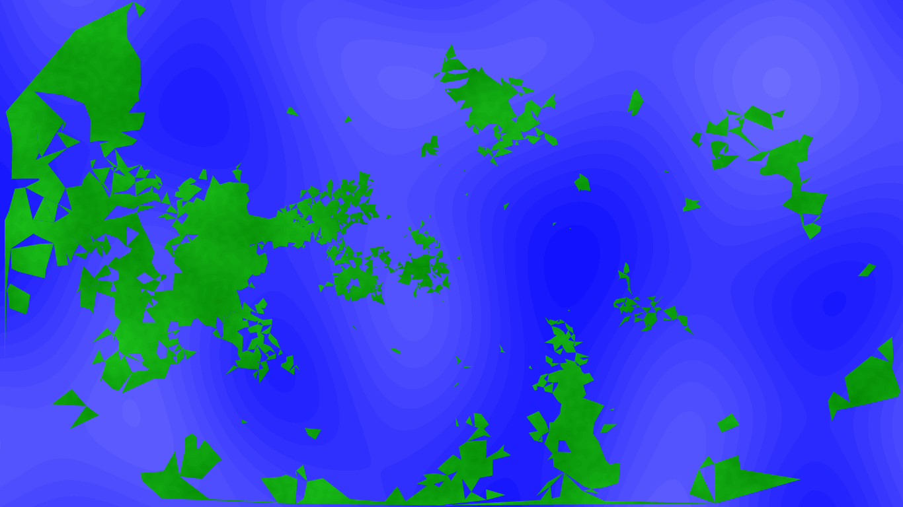
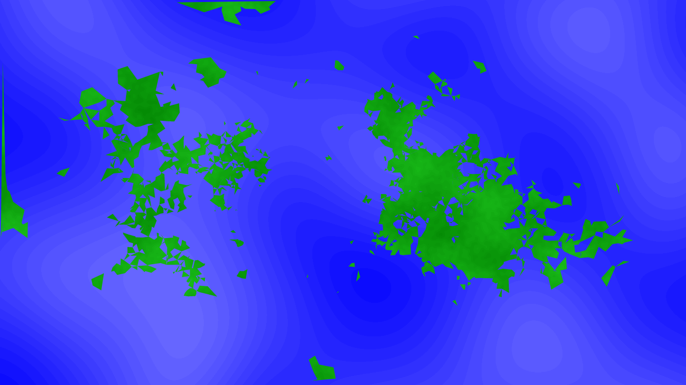

# Map generator

This is a basic map generator made in 1 week for the [code community](https://discord.gg/RFPVysw) code jam
You can check out [the demo](https://mateiadrielrafael.github.io/map-generator/)!

# Tehnologies

Made with

- typescript
- webpack & babel for bundling & transpiling the assets
- d3-delaunay for the delaunay triangulation algorithm

# Screenshots

A few screenshots from the current state of the project:

